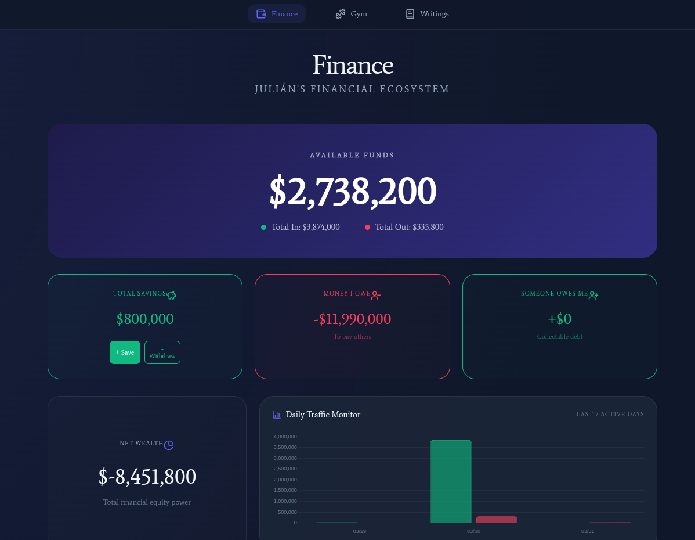
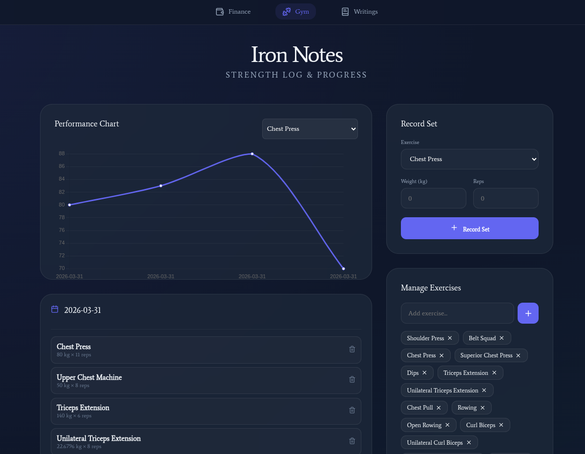
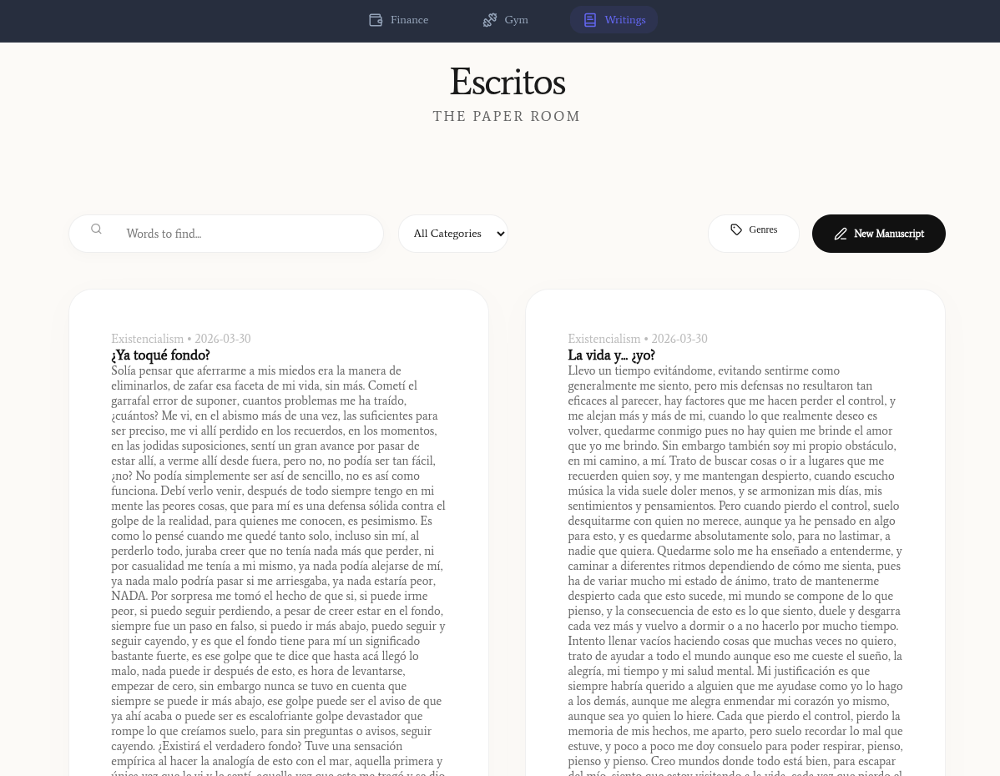

# 🌌 NobodysStache Ecosystem

Un ecosistema personal avanzado diseñado para centralizar el control de las **finanzas**, el **progreso físico** y la **creación literaria**. Esta plataforma ofrece una interfaz moderna, oscura y altamente interactiva para gestionar el día a día con total claridad.



## 🚀 Características Principales

### 💰 Gestión Financiera (Finance)
Control total sobre tu flujo de caja con una visualización de datos de primer nivel.
- **Seguimiento de Saldos**: Visualiza tus fondos disponibles, ahorros y patrimonio neto en tiempo real.
- **Gráficos Dinámicos**: Monitorización del tráfico diario y distribución de egresos por categorías.
- **Gestión de Deudas**: Sistema integrado para controlar préstamos (por cobrar y por pagar) con barras de progreso.
- **Categorización Flexible**: Crea y gestiona tus propias fuentes de ingresos y gastos.


### 🏋️ Entrenamientos (Gym)
Mantén un registro detallado de tu evolución física.
- **Dashboard de Ejercicios**: Visualiza tu volumen de entrenamiento y récords personales.
- **Historial de Sesiones**: Registro cronológico de cada levantamiento y marca.
- **Análisis de Progreso**: Gráficos que muestran tu constancia y fuerza a lo largo del tiempo.



### ✍️ Espacio Creativo (Writing)
Un refugio minimalista para tus ideas y escritos.
- **Organización por Categorías**: Clasifica tus textos (novelas, artículos, pensamientos) fácilmente.
- **Editor sin Distracciones**: Interfaz limpia diseñada para fomentar el flujo creativo.
- **Biblioteca Personal**: Acceso rápido a todos tus escritos previos.



---

## 🛠️ Stack Tecnológico
- **Frontend**: React.js, TailwindCSS (opcional/personalizado), Lucide Icons.
- **Visualización**: Chart.js & React-Chartjs-2.
- **Backend**: Node.js & Express.
- **Almacenamiento**: Sistema de archivos local (Data Persistence).

---

## ⚙️ Instalación y Uso

1. **Clonar el repositorio:**
   ```bash
   git clone https://github.com/Jleon13/NobodysStache_Ecosystem.git
   cd NobodysStache_Ecosystem
   ```

2. **Instalar dependencias:**
   ```bash
   npm install
   cd client && npm install
   ```

3. **Ejecutar en modo desarrollo:**
   Regresa a la raíz y ejecuta:
   ```bash
   npm run dev
   ```

---

## 🔒 Seguridad de Datos
Este proyecto está configurado para **no subir archivos de datos reales** (`.txt`, `.json` en la carpeta `/data`) a GitHub, protegiendo así tu privacidad financiera y personal.

---

> *Desarrollado con ❤️ para organizar el caos cotidiano.*
