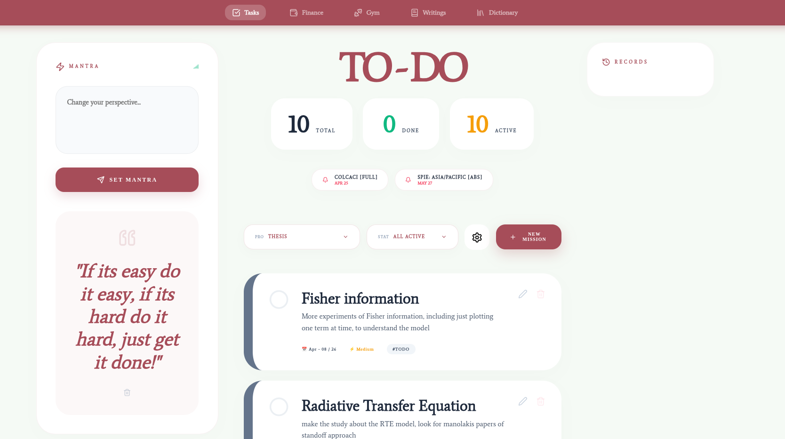
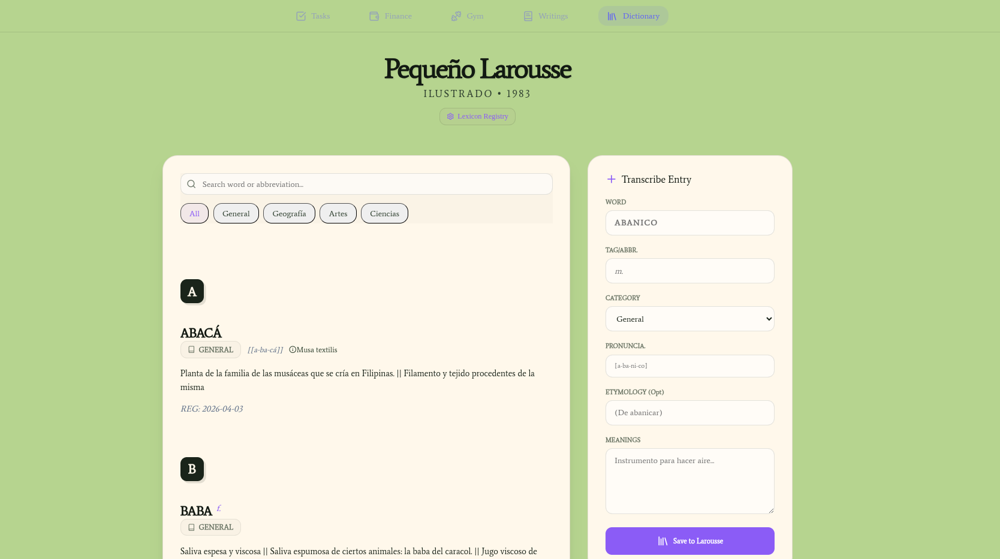

# 🌿 ECO: Personal Ecosystem

A premium, minimalist workspace for personal finance, task management, and academic reminders. Built with a focus on tranquility and productivity.



## 🚀 Concept
**ECO** is designed to be your digital center of operations. It is not just a to-do list; it's a productivity hub where your focus (Mantra), your immediate goals (Tasks), and your history (Records) coexist in a balanced, aesthetic layout.

## 🏗️ Key Modules

### 🗒️ TO - DO Hub
Advanced task tracking with priority-based sorting (High > Medium > Low) and manual special deadlines for conferences and papers.


### 💰 Finance & Savings
Tracker for savings, debts, and transaction history with real-time liquidity calculation.


### 🏋️ Gym & Wellness
Workout logging and exercise progress tracking.


### ✍️ Writings & Creative Hub
A dedicated space for creative writing, reflections, and thoughts.


### 📖 Personal Dictionary
Build your own database of terms, meanings, and abbreviations.


## 📂 Data & Persistence (Safe for GitHub)
This project is designed for **data privacy** and **easy deployment**:
1. **Local JSON Persistence**: All data is stored in plain-text `.txt` files (JSON format) within the `data/` directory.
2. **Auto-Initialization**: The server uses a robust `initFiles()` logic. When you run the application for the first time, it automatically creates all necessary data files with the correct default structures if they don't exist.
3. **GitHub Ready**: The `.gitignore` is configured to ignore all `.txt` files in `data/`. This ensures your personal information stays on your machine, while anyone else who clones the repo gets a fresh, empty environment.

## 🛠️ Installation
1. Clone the repository.
2. Install dependencies:
   ```bash
   npm install
   cd client && npm install
   ```
3. Run the development environment:
   ```bash
   npm run dev
   ```
4. The server will start on port `3001` and the frontend on `5173`. On first run, it will automatically populate the `data/` folder with empty structures.

## ✨ Aesthetics
- **Color Palette**: Soft pastel greens, whites, and brand Vino Tinto.
- **Typography**: Elegant serif fonts (Average) mixed with modern sans-serif.
- **Layout**: 3-column minimalist grid for reduced cognitive load.
